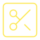

<div align="center" style="margin-bottom: 10px;">



</div>

<div align="center" style="display: flex; gap: 10px; align-items:center; justify-content: center; margin-top:50px;">


</div>

# Ideia

Desenvolver uma plataforma para facilitar a conexão entre clientes em busca de cortes de cabelo e barbearias ou barbeiros independentes.
Reconhecimento da necessidade de um sistema que simplifique o processo de encontrar serviços de corte de cabelo de qualidade, enquanto oferece aos profissionais da área uma maneira eficaz de promover seus serviços.

# Desenvolvimento

### Tecnologias e ferramentas utilizadas:

- TypeScript
- React
- Next JS
- Tailwind CSS
- Framer Motion

# Instalar o Projeto

**Pré-requisitos:**
Certifique-se de ter o Node.js e o npm instalados em seu sistema.

**Passo 1: Clonar o repositório**
```
git clone https://github.com/RelancioBorgesDev/CutConnect.git
```

**Passo 2: Acessar o diretório do projeto**
```
cd CutConnect-main
```

**Passo 3: Instalar as dependências do projeto**
```
npm install
```
ou
```
yarn install
```


**Passo 4: Executar o projeto em modo de desenvolvimento**
```
npm run dev
```
ou
```
yarn dev
```

Este comando irá iniciar o servidor de desenvolvimento. Você poderá acessar o projeto em seu navegador em `http://localhost:3000` (ou outra porta, dependendo das configurações).

**Passo 5: Parar o servidor de desenvolvimento**

Para parar o servidor de desenvolvimento, basta pressionar `Ctrl + C` no terminal onde o servidor está sendo executado.

Com esses passos, você poderá iniciar e explorar o projeto em Next.js localmente em seu sistema.
